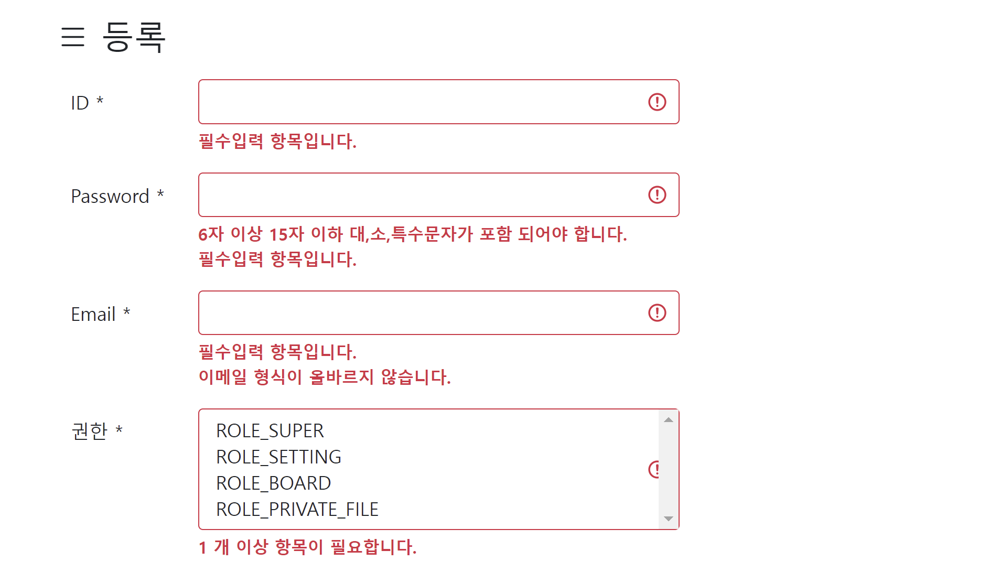

# Validation 가이드

자바 세계에서 파라미터를 검증하는 표준 기술은 Bean Validation API (https://beanvalidation.org) 입니다.

## step.1 - Bean Validation API 가능한한 많이 사용하기

javax.validation.constraints 패키지가 제공하는 @NotBlack, @Email 등 어노테이션을 적용하는 것 만으로도 기본적인 검증을 수행할 수 있습니다. 

```java
public class SomeDto {
  @NotBlank(message = "{valid.common.required}")
  @Pattern(regexp = "^.*[^\\\\.]$", message = "{valid.admin.id.notEndWith.dot}")
  private String id;
}
```

특히 @Pattern 은 정규표현식을 이용해 다양한 검증사례를 설계하는 강력한 어노테이션입니다.

## step.2 - Validator 로 검증하기
constraints 어노테이션만으로 부족하다면 `Validator` 인터페이스 사용을 고려해보세요.  
다음 코드는 예제 게시판에서 글을 등록할 때 사용자 입력값을 검증하기위해 `Validator` 인터페이스를 구현한 검증객체입니다.

```java
@Component
@RequiredArgsConstructor
public class ExampleBoardFormValidator implements Validator {

  @Override
  public boolean supports(Class<?> clazz) {
    return ExampleBoardFormDto.class.equals(clazz);
  }

  @Override
  public void validate(Object target, Errors errors) {
    ValidationUtils.rejectIfEmptyOrWhitespace(errors, "title", "valid.common.required");
    ValidationUtils.rejectIfEmptyOrWhitespace(errors, "content", "valid.common.required");
  }
}
```

`Controller` 메서드에 Validator 가 사용되는데 이때 메서드 인자로 DTO 객체와 BindingResult 객체를 나란히 선언(중요) 해주어야 합니다. (순서가 중요) 

```java
@PostMapping("create")
public String createPost(
    // ...
    @ModelAttribute("formDto") ExampleBoardFormDto formDto,
    BindingResult bindingResult)
      throws IOException {

    exampleBoardFormValidator.validate(formDto, bindingResult);
    if (bindingResult.hasErrors()) {
    return "board/exampleBoardForm";
    }
    
    // ...
}

```


이제 `bindingResult` 의 hasError 메서드를 통해 검증에 위배된 항목이 발견되면 메서드 수행을 멈추고 이전 입력폼 화면으로 리턴합니다. 
`@ModelAttribute` 를 통해 DTO 객체는 formDto 속성명으로 model 에 담겨 자동 전달됩니다. 

입력폼에서 검증 실패 메세지를 보여줄 때 Thymeleaf 의 `th:object` 와 `th:errors` 를 이용합니다. 

```html
<form th:object="${formDto}">
  <input th:field="*{id}" 
         th:classappend="${#fields.hasErrors('id')} ? 'is-invalid'"/>
  <div class="invalid-feedback fw-bold" th:if="${#fields.hasErrors('id')}" th:errors="*{id}">
    에러 메세지
  </div>
</form>
```

form 태그에 매핑된 `th:object` 를 통해 form 필드(`th:field`)와 에러 메세지(`th:errors`)를 연결할 수 있습니다.
아래는 검증 실패 메세지가 표현된 화면입니다.




## step.3 - Ajax 요청일 경우 검증 처리

Ajax 비동기 요청의 요청 주체는 Javascript 이기에 validation 실패 메세지 또한 **JSON 응답 형식**으로 전달되야 합니다.

```java
@PostMapping("save")
@Transactional
public ResponseEntity<?> save(URIFormDto formDto, BindingResult bindingResult)
        throws IOException {
    ValidationUtils.invokeValidator(uriFormValidator, formDto, bindingResult);
    if (bindingResult.hasErrors()) {
    return commonUtil.getValidationFailResponseEntity(bindingResult);
    }
    // ...
```

`bindingResult.fieldErrors` 목록을 commonUtil 을 이용해 DTO 로 변환 후 응답객체 본문에 담고, HttpStatus 코드 422 와 함께 내려줍니다. 

* 422 (HttpStatus.UNPROCESSABLE_ENTITY) 는 검증 실패와 관련해 가장 적합한 HTTP 상태코드입니다.

$.ajax 콜백에서 검증 실패시 처리를 위해 아래와 같이 **httpStatus 콜백을 명시적으로 선언**하는 것을 권장합니다. 

```javascript
$.ajax({
    type: 'POST',
    url: '/api/uri/save',
    statusCode: {
        // validation 실패 시 처리
        422: function (response) {
            const fieldErrors = response.responseJSON;
            let form = document.formDto;
            $(fieldErrors).each(function (idx, error) {
                $(form[error.field]).addClass('is-invalid');
                $('.field-' + error.field).text(error.message);
            });
        }
    }
});
```

json.fieldErrors 배열 loop 을 돌며, field 와 defaultMessage 를 alert 로 뛰울 수 있고, 위의 예처럼 bootstrap CSS 를 이용해 화면에 render 해주는 방식도 가능합니다.

$.ajax 의 fail 콜백함수를 사용해도 되지만,
validation 처리 외에 **예외 발생시 시 응답코드 400 를 전달**하는 등 다른 정책들도 있기에
statusCode 선언을 통한 명시적인 분기처리를 권장합니다.
